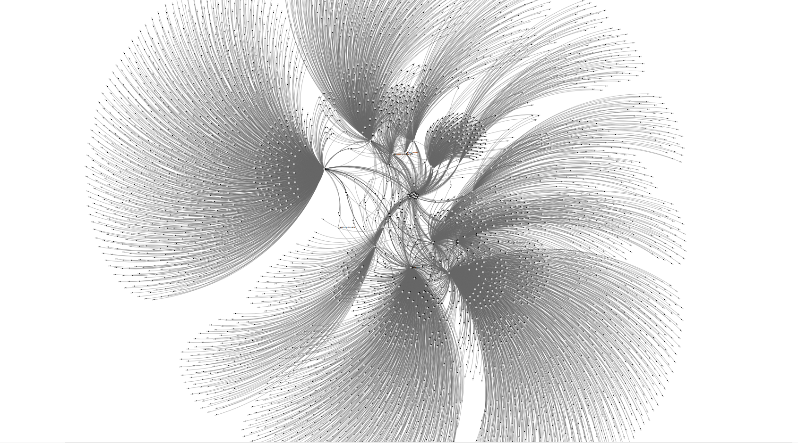
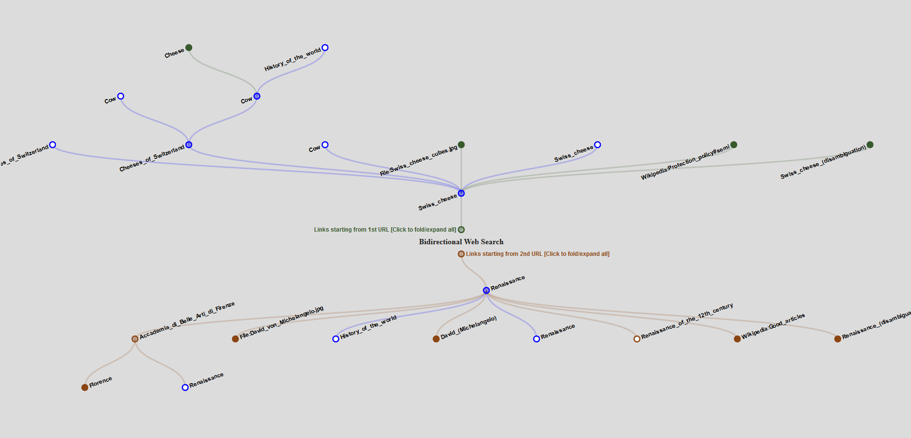

# Wikipedia Path Finder

This is a program that allows you to find a path between Wikipedia articles (but will also work between any two URL's).
If a path does exist, the exact order of pages to visit will be printed, and an interactive search tree will be generated to visualize how the search progressed.

## Usage

To run the program you need Java 1.6 or greater. If you just want to run the program, download the weblink.jar file and run:

    $ java -jar weblink.jar "url-1" "url-2"

Alternatively, if you'd like to run it from source, the only other components you need are Clojure and Leiningen, which you can get here:
- [Clojure 1.8](https://repo1.maven.org/maven2/org/clojure/clojure/1.8.0/clojure-1.8.0.zip)
- [Leiningen](http://leiningen.org/)

Once you have the prerequisites, simply run from the command line:

    $ lein run "url-1" "url-2"
    
After running either of these, an updated JSON file holding the results will be generated in www/bidir.json
In order to view the result as an interactive graph, open the file www/bidirectional_tree.html in your browser.

## Examples

As an example, let's try to find a path from the Renaissance to Swiss cheese:

```clojure
$ java -jar weblink.jar "https://en.wikipedia.org/wiki/Renaissance" "https://en.wikipedia.org/wiki/Swiss_cheese"
("https://en.wikipedia.org/wiki/Swiss_cheese"
 "https://en.wikipedia.org/wiki/Cheeses_of_Switzerland"
 "https://en.wikipedia.org/wiki/Cow"
 "https://en.wikipedia.org/wiki/History_of_the_world"
 "https://en.wikipedia.org/wiki/Renaissance")
$ 

```

Now, let's view the results as a force-directed graph:



This is a complete graph of all nodes searched as well as their children. This is a little difficult to make sense of (and very difficult for the browser to handle), so instead let's view only the nodes that were actually opened and searched while finding the complete path:



Much cleaner! Above is a bidirectional search tree which shows how both halves of the search progressed. Any nodes that were ultimately part of the complete path are highlighted in blue.

## Future Improvements
- Support for finding common path between 3 or more links
- Display search results in real-time via a live server

## License

Copyright © 2016 Christian N Packard

Distributed under the MIT License
